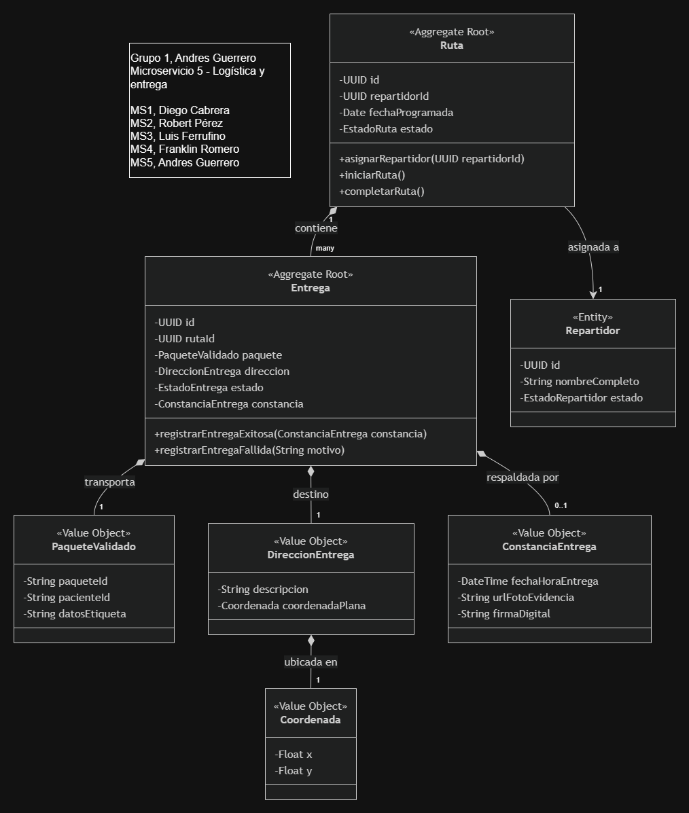

## Domain Model



## Ejecución con Docker

### Requisitos

- [Docker Desktop](https://www.docker.com/products/docker-desktop/) instalado y en ejecución.

### 1. Construir la imagen

```powershell
docker build -t nurtricenter-api .
```

| Parte                 | Significado                                                                                                                                                       |
| --------------------- | ----------------------------------------------------------------------------------------------------------------------------------------------------------------- |
| `docker build`        | Comando de Docker que construye una imagen a partir del `Dockerfile` encontrado en el contexto de compilación.                                                    |
| `-t nurtricenter-api` | Etiqueta la imagen resultante con el nombre `nurtricenter-api` para poder referenciarla más adelante.                                                             |
| `.`                   | El contexto de compilación: el directorio actual. Su contenido se envía al demonio de Docker y se usa como directorio de trabajo para los pasos del `Dockerfile`. |

### 2. Ejecutar el contenedor

En PowerShell, ejecuta el contenedor pasando las variables de entorno requeridas (reemplaza la cadena de conexión de la base de datos con la cadena correcta que se encuentra en el .env):

```powershell
docker run --rm -p 8080:8080 `
    -e "ConnectionStrings__DefaultConnection=Host={HOST}; Database=neondb; Username=neondb_owner; Password={PASSWORD}; SSL Mode=VerifyFull; Channel Binding=Require;" `
    -e "ClinicService__BaseUrl=https://763708cb-6809-4a65-be56-fe140385a461.mock.pstmn.io" `
    -e "branchCoordinates__latitude=-17.768853725548713" `
    -e "branchCoordinates__longitude=-63.18276022365929" `
    nurtricenter-api
```

| Parte               | Significado                                                                                                                                                                                                                                         |
| ------------------- | --------------------------------------------------------------------------------------------------------------------------------------------------------------------------------------------------------------------------------------------------- |
| `docker run`        | Crea e inicia un nuevo contenedor a partir de la imagen indicada.                                                                                                                                                                                   |
| `--rm`              | Elimina automáticamente el contenedor cuando se detiene, para que no queden contenedores acumulados.                                                                                                                                                |
| `-p 8080:8080`      | Publica el puerto `8080` del contenedor en el puerto `8080` del host (`host:contenedor`).                                                                                                                                                           |
| `` ` ``             | Carácter de continuación de línea de PowerShell: permite dividir el comando en varias líneas.                                                                                                                                                       |
| `-e "NOMBRE=valor"` | Establece una variable de entorno dentro del contenedor. El `__` (doble guion bajo) se mapea a `:` en la configuración de .NET, por lo que `ConnectionStrings__DefaultConnection` establece la configuración `ConnectionStrings:DefaultConnection`. |
| `nurtricenter-api`  | La imagen construida en el paso anterior.                                                                                                                                                                                                           |

Variables de entorno:

| Variable                               | Propósito                                                                 |
| -------------------------------------- | ------------------------------------------------------------------------- |
| `ConnectionStrings__DefaultConnection` | Cadena de conexión a PostgreSQL (Neon) usada por la capa de persistencia. |
| `ClinicService__BaseUrl`               | URL base del servicio externo de clínicas con el que se integra la API.   |
| `branchCoordinates__latitude`          | Latitud de la sucursal usada como punto de partida de las entregas.       |
| `branchCoordinates__longitude`         | Longitud de la sucursal usada como punto de partida de las entregas.      |

Una vez en ejecución, verifica el health check del contenedor en <http://localhost:8080/health>.

### Para ejecutar con Docker Compose

El repositorio también incluye un `docker-compose.yml`, que lee las variables de entorno desde un archivo `.env` en la raíz del proyecto (a continuación se muestran las variables, la cadena de conexión a la base de datos no es la real por temas de seguridad y la correcta se muestra en el `.env`):

```dotenv
ConnectionStrings__DefaultConnection=HOST; Database=neondb; Username=neondb_owner; Password=PASSWORD; SSL Mode=VerifyFull; Channel Binding=Require;
ClinicService__BaseUrl=https://763708cb-6809-4a65-be56-fe140385a461.mock.pstmn.io
branchCoordinates__latitude=-17.768853725548713
branchCoordinates__longitude=-63.18276022365929
```

Luego construye e inicia los servicios:

```powershell
docker compose up --build
```

Para detener y eliminar los contenedores:

```powershell
docker compose down
```
