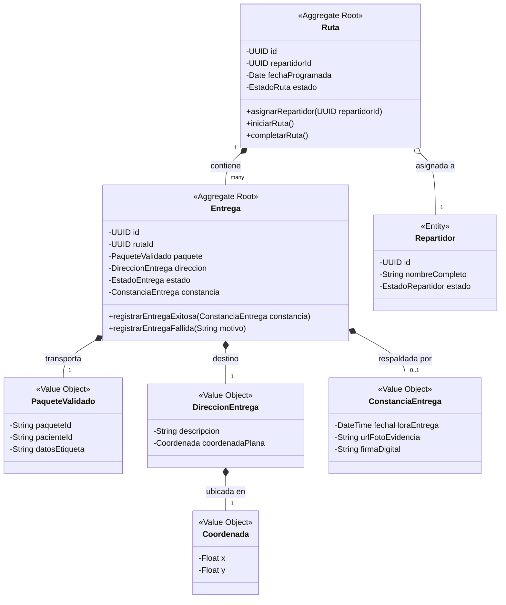

```mermaid
classDiagram
    %% Definición de Agregados y Entidades
    class Ruta {
        <<Aggregate Root>>
        -UUID id
        -UUID repartidorId
        -Date fechaProgramada
        -EstadoRuta estado
        +asignarRepartidor(UUID repartidorId)
        +iniciarRuta()
        +completarRuta()
    }

    class Entrega {
        <<Aggregate Root>>
        -UUID id
        -UUID rutaId
        -PaqueteValidado paquete
        -DireccionEntrega direccion
        -EstadoEntrega estado
        -ConstanciaEntrega constancia
        +registrarEntregaExitosa(ConstanciaEntrega constancia)
        +registrarEntregaFallida(String motivo)
    }

    class Repartidor {
        <<Entity>>
        -UUID id
        -String nombreCompleto
        -EstadoRepartidor estado
    }

    %% Definición de Value Objects
    class PaqueteValidado {
        <<Value Object>>
        -String paqueteId
        -String pacienteId
        -String datosEtiqueta
    }

    class DireccionEntrega {
        <<Value Object>>
        -String descripcion
        -Coordenada coordenadaPlana
    }

    class Coordenada {
        <<Value Object>>
        -Float x
        -Float y
    }
    
    class ConstanciaEntrega {
        <<Value Object>>
        -DateTime fechaHoraEntrega
        -String urlFotoEvidencia
        -String firmaDigital
    }

    %% Relaciones
    Ruta "1" *-- "many" Entrega : contiene
    Ruta o-- "1" Repartidor : asignada a
    Entrega *-- "1" DireccionEntrega : destino
    Entrega *-- "1" PaqueteValidado : transporta
    Entrega *-- "0..1" ConstanciaEntrega : respaldada por
    DireccionEntrega *-- "1" Coordenada : ubicada en
```