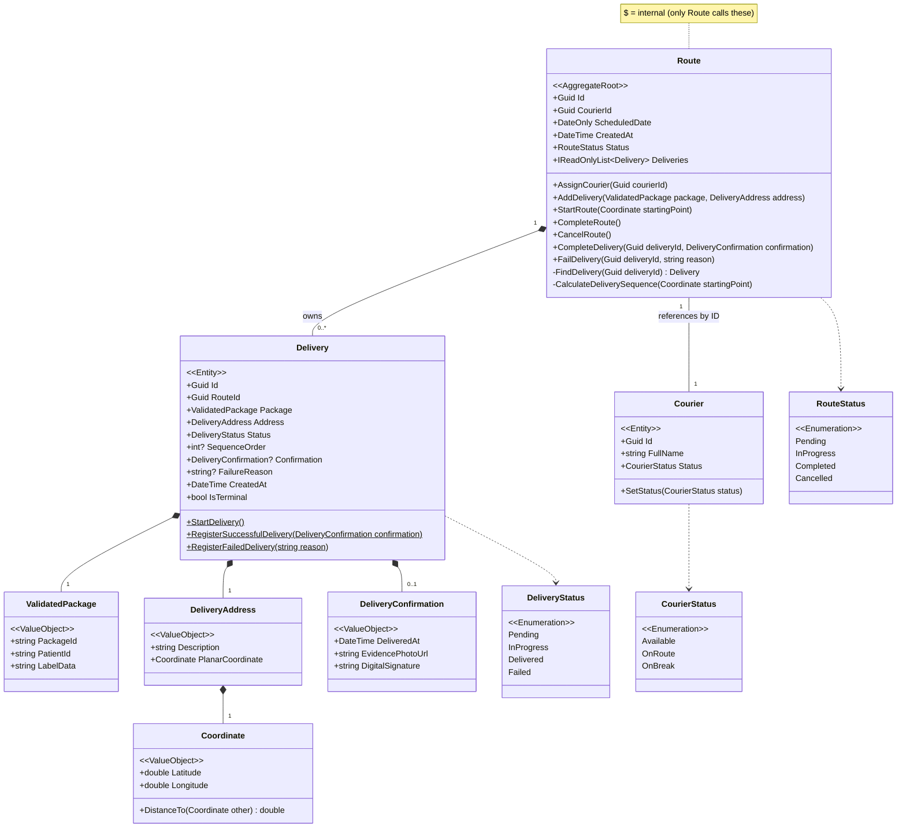

# Domain Model

## Domain Events

| Event | Trigger | Payload |
|---|---|---|
| `CourierCreatedEvent` | Courier constructed | `Id`, `FullName`, `Status` |
| `CourierStatusChangedEvent` | `Courier.SetStatus()` | `CourierId`, `OldStatus`, `NewStatus` |
| `RouteCreatedEvent` | Route constructed | `RouteId`, `CourierId`, `ScheduledDate` |
| `CourierAssignedToRouteEvent` | `Route.AssignCourier()` | `RouteId`, `CourierId` |
| `DeliveryAddedToRouteEvent` | `Route.AddDelivery()` | `RouteId`, `DeliveryId`, `PackageId`, `PatientId` |
| `RouteStartedEvent` | `Route.StartRoute()` | `RouteId` |
| `RouteCompletedEvent` | `Route.CompleteRoute()` | `RouteId` |
| `RouteCancelledEvent` | `Route.CancelRoute()` | `RouteId` |
| `DeliveryCompletedEvent` | `Delivery.RegisterSuccessfulDelivery()` | `DeliveryId`, `RouteId`, `DeliveredAt` |
| `DeliveryFailedEvent` | `Delivery.RegisterFailedDelivery()` | `DeliveryId`, `RouteId`, `Reason` |

## Repository Interfaces

| Interface | Base | Key methods beyond base |
|---|---|---|
| `IRouteRepository` | `IRepository<Route>` | `GetAllAsync`, `GetLatestRouteForTodayAsync`, `GetByCourierAndDateAsync`, `UpdateAsync`, `DeleteAsync` |
| `ICourierRepository` | _(standalone)_ | `GetByIdAsync`, `GetAllAsync`, `GetByStatusAsync`, `AddAsync`, `UpdateAsync`, `DeleteAsync` |

> **Note:** `Delivery` has no repository and no `DbSet`. All persistence goes through `Route` (the aggregate root).
